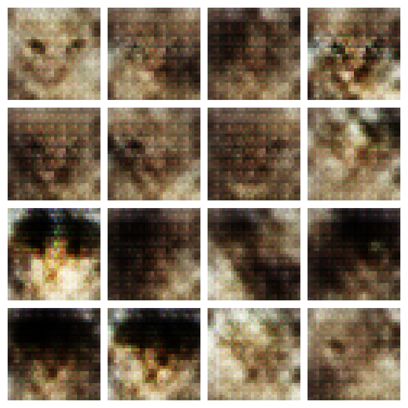
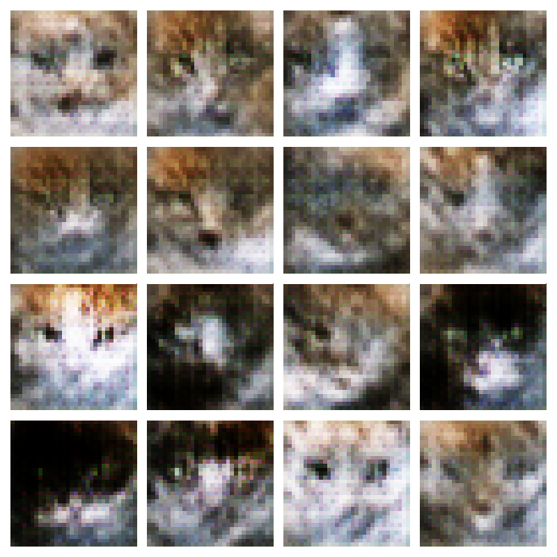
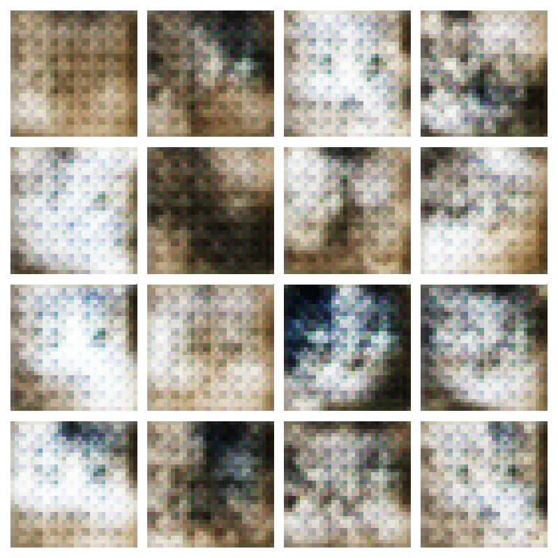
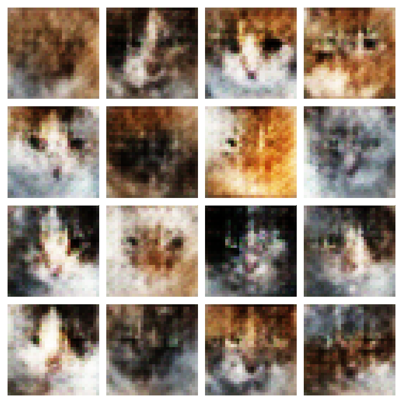

## Experiment 01 — Initial 32×32 RGB baseline

- Model name: `cat_gan_v1`
- Architecture version: `dcgan_rgb_v1`

### Change and reason

Established a baseline GAN for generating 32×32 colour cat images.

The generator starts with an 8×8×256 feature map and uses three
5×5 transpose convolutions with strides of 1, 2, and 2.
Its output is a 32×32 RGB image.

The discriminator uses two 5×5 stride-2 convolutions, each
with 64 filters, followed by a single real/fake score.

This run provides a reference for evaluating later changes
to image quality, artifacts, diversity, and training speed.

### Settings

| Setting                            | Value                                          |
| ---------------------------------- | ---------------------------------------------- |
| Dataset                            | Local cat dataset                              |
| Training images                    | 15,747                                         |
| Input/output                       | 32×32 RGB                                      |
| Preprocessing                      | Bilinear resize, stretch, normalize to [-1, 1] |
| Batch size                         | 256                                            |
| Noise dimensions                   | 100                                            |
| Optimizer                          | Adam                                           |
| Learning rate                      | 0.0001                                         |
| Generator convolution filters      | 128 → 64 → 3                                   |
| Generator convolution kernels      | 5×5 throughout                                 |
| Generator hidden activation        | ReLU                                           |
| Generator output activation        | tanh                                           |
| Discriminator convolution filters  | 64 → 64                                        |
| Discriminator activation           | ReLU                                           |
| Discriminator dropout              | 0.3 after each activation                      |
| Preview noise seed                 | [42, 0]                                        |
| Training random seed               | Not explicitly set                             |
| Completed epochs                   | 100                                            |
| Generator trainable parameters     | 2,700,352                                      |
| Discriminator trainable parameters | 111,425                                        |

### Generated outputs

Fixed preview noise is reused across epochs to track changes.

| Epoch | Generated samples                                                   |
| ----- | ------------------------------------------------------------------- |
| 50    |   |
| 100   |  |

## Experiment 02 — 4×4 generator upsampling kernels

- Model name: `cat_gan_kernel4_v1`
- Architecture version: `dcgan_rgb_kernel4_v1`

### Change and reason

Changed the generator's two stride-2 transpose convolutions
from 5×5 to 4×4 kernels.

The baseline produced visible grid patterns. A kernel size
divisible by the stride avoids uneven overlap, which may
reduce these artifacts.

The first stride-1 layer and discriminator remain unchanged.

### Settings

| Setting                            | Value                                          |
| ---------------------------------- | ---------------------------------------------- |
| Dataset                            | Local cat dataset                              |
| Training images                    | 15,747                                         |
| Input/output                       | 32×32 RGB                                      |
| Preprocessing                      | Bilinear resize, stretch, normalize to [-1, 1] |
| Batch size                         | 256                                            |
| Noise dimensions                   | 100                                            |
| Optimizer                          | Adam                                           |
| Learning rate                      | 0.0001                                         |
| Generator hidden activation        | ReLU                                           |
| Generator output activation        | tanh                                           |
| Discriminator activation           | ReLU                                           |
| Preview noise seed                 | [42, 0]                                        |
| Training random seed               | Not explicitly set                             |
| Completed epochs                   | 100                                            |
| Generator trainable parameters     | 2,624,896                                      |
| Discriminator trainable parameters | 111,425                                        |

### Output comparison

Use the same preview noise and compare matching epochs.

| Epoch | Baseline                                                      | This experiment                                                      |
| ----- | ------------------------------------------------------------- | -------------------------------------------------------------------- |
| 50    |   |   |
| 100   |  |  |
